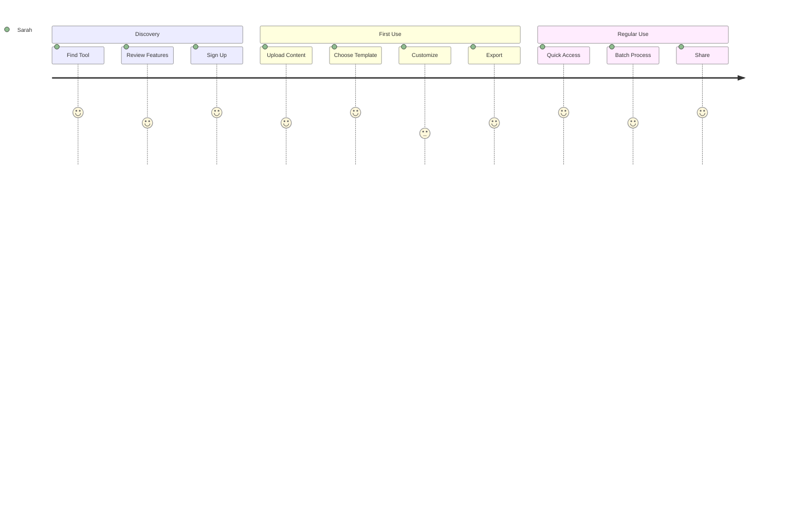
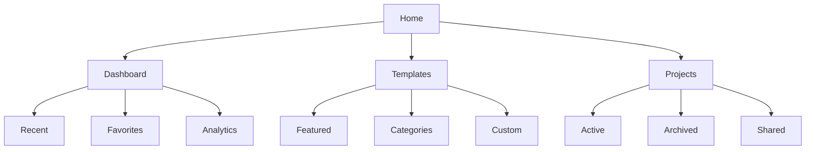

# UX Design Document (UXDD)

## 1. Design Principles

### 1.1 Core Principles

1. **Clarity**

   - Clear visual hierarchy
   - Intuitive navigation
   - Explicit feedback
   - Meaningful labels

2. **Efficiency**

   - Minimal steps to accomplish tasks
   - Quick access to common functions
   - Smart defaults
   - Keyboard shortcuts

3. **Consistency**

   - Uniform interaction patterns
   - Consistent terminology
   - Standardized components
   - Predictable behavior

4. **Flexibility**
   - Customizable workflows
   - Multiple paths to goals
   - Adaptable interfaces
   - Progressive disclosure

### 1.2 Design Philosophy

```yaml
Design Approach:
  Principles:
    - User-Centered Design
    - Progressive Enhancement
    - Mobile-First Responsive
    - Accessibility by Default

  Goals:
    - Reduce Cognitive Load
    - Minimize Learning Curve
    - Maximize Efficiency
    - Ensure Accessibility
```

## 2. User Research

### 2.1 User Personas

#### Primary Persona: Content Creator Sarah

```yaml
Demographics:
  Age: 28-35
  Role: Digital Content Manager
  Technical Skill: Intermediate

Goals:
  - Create engaging visual content quickly
  - Maintain consistent brand style
  - Export in multiple formats
  - Share with team members

Pain Points:
  - Time-consuming manual visualization
  - Inconsistent design outputs
  - Complex design tools
  - Format compatibility issues
```

#### Secondary Persona: Data Analyst David

```yaml
Demographics:
  Age: 30-40
  Role: Business Analyst
  Technical Skill: Advanced

Goals:
  - Transform data into clear visuals
  - Create professional presentations
  - Automate visualization process
  - Maintain data accuracy

Pain Points:
  - Manual data visualization
  - Limited customization options
  - Lack of template variety
  - Export quality issues
```

### 2.2 User Journey Maps

#### Content Creation Journey



## 3. Information Architecture

### 3.1 Site Map



### 3.2 Navigation Structure

```yaml
Primary Navigation:
  - Dashboard:
      icon: home
      priority: 1
  - Create New:
      icon: plus
      priority: 1
  - Templates:
      icon: template
      priority: 2
  - Projects:
      icon: folder
      priority: 2

Secondary Navigation:
  - Settings:
      icon: gear
      location: header
  - Profile:
      icon: user
      location: header
  - Help:
      icon: question
      location: header

Mobile Navigation:
  - Primary Items: 4
  - More Menu: true
  - Bottom Navigation: true
```

## 4. Interaction Design

### 4.1 Interaction Patterns

#### Text Input Flow

```yaml
Steps:
  1. Enter Text:
    - Multi-line input
    - Character count
    - Auto-save
    - Formatting options

  2. Choose Visualization:
    - Template gallery
    - Recent templates
    - Custom options
    - Preview

  3. Customize:
    - Style controls
    - Color schemes
    - Typography
    - Layout options

  4. Export/Share:
    - Format selection
    - Quality options
    - Share settings
    - Download
```

#### Gesture Support

```yaml
Mobile Gestures:
  Swipe:
    Left: Next item
    Right: Previous item
    Down: Close panel
    Up: Open panel

  Pinch:
    In: Zoom out
    Out: Zoom in

  Double Tap:
    Action: Quick zoom

  Long Press:
    Action: Context menu
```

### 4.2 State Management

```yaml
Component States:
  Button:
    Default: Normal state
    Hover: Subtle highlight
    Active: Pressed state
    Disabled: Greyed out
    Loading: Progress indicator

  Input:
    Empty: Placeholder text
    Focus: Highlighted border
    Valid: Success indicator
    Invalid: Error message
    Disabled: Greyed out

  Process:
    Idle: Ready state
    Processing: Progress indicator
    Success: Completion message
    Error: Error message
    Recovery: Retry option
```

## 5. Visual Design System

### 5.1 Typography

```css
/* Typography Scale */
:root {
  /* Headings */
  --h1: 2.5rem/1.2; /* 40px */
  --h2: 2rem/1.3; /* 32px */
  --h3: 1.5rem/1.4; /* 24px */
  --h4: 1.25rem/1.4; /* 20px */

  /* Body Text */
  --body-large: 1.125rem/1.5; /* 18px */
  --body: 1rem/1.5; /* 16px */
  --body-small: 0.875rem/1.5; /* 14px */
  --caption: 0.75rem/1.5; /* 12px */

  /* Font Weights */
  --weight-regular: 400;
  --weight-medium: 500;
  --weight-semibold: 600;
  --weight-bold: 700;
}
```

### 5.2 Color System

```css
/* Color Palette */
:root {
  /* Primary Colors */
  --primary-50: #f0f9ff;
  --primary-100: #e0f2fe;
  --primary-200: #bae6fd;
  --primary-300: #7dd3fc;
  --primary-400: #38bdf8;
  --primary-500: #0ea5e9;
  --primary-600: #0284c7;
  --primary-700: #0369a1;
  --primary-800: #075985;
  --primary-900: #0c4a6e;

  /* Neutral Colors */
  --neutral-50: #f8fafc;
  --neutral-100: #f1f5f9;
  --neutral-200: #e2e8f0;
  --neutral-300: #cbd5e1;
  --neutral-400: #94a3b8;
  --neutral-500: #64748b;
  --neutral-600: #475569;
  --neutral-700: #334155;
  --neutral-800: #1e293b;
  --neutral-900: #0f172a;

  /* Semantic Colors */
  --success: #10b981;
  --warning: #f59e0b;
  --error: #ef4444;
  --info: #3b82f6;
}
```

### 5.3 Spacing System

```css
/* Spacing Scale */
:root {
  --space-1: 0.25rem; /* 4px */
  --space-2: 0.5rem; /* 8px */
  --space-3: 0.75rem; /* 12px */
  --space-4: 1rem; /* 16px */
  --space-5: 1.5rem; /* 24px */
  --space-6: 2rem; /* 32px */
  --space-8: 3rem; /* 48px */
  --space-10: 4rem; /* 64px */
  --space-12: 6rem; /* 96px */
  --space-16: 8rem; /* 128px */
}
```

### 5.4 Component Library

#### Button System

```yaml
Button Variants:
  Primary:
    Background: primary-600
    Text: white
    Hover: primary-700
    Active: primary-800

  Secondary:
    Background: white
    Border: neutral-200
    Text: neutral-700
    Hover: neutral-50

  Ghost:
    Background: transparent
    Text: neutral-600
    Hover: neutral-100

Sizes:
  Small:
    Padding: space-2 space-3
    Font: body-small
    Height: 32px

  Medium:
    Padding: space-3 space-4
    Font: body
    Height: 40px

  Large:
    Padding: space-4 space-5
    Font: body-large
    Height: 48px
```

#### Form Controls

```yaml
Input Fields:
  Text Input:
    Height: 40px
    Padding: space-3
    Border: neutral-200
    Radius: radius-md

  Textarea:
    Min Height: 100px
    Padding: space-3
    Border: neutral-200
    Radius: radius-md

  Select:
    Height: 40px
    Padding: space-3
    Border: neutral-200
    Radius: radius-md

States:
  Focus:
    Border: primary-500
    Ring: primary-500/20

  Error:
    Border: error
    Ring: error/20

  Success:
    Border: success
    Ring: success/20
```

## 6. Accessibility Guidelines

### 6.1 WCAG Compliance

```yaml
Compliance Level: WCAG 2.1 AA

Focus Areas:
  Perceivable:
    - Alt text for images
    - Captions for videos
    - Proper color contrast
    - Responsive text sizing

  Operable:
    - Keyboard navigation
    - Skip links
    - Focus management
    - Touch targets

  Understandable:
    - Clear labels
    - Consistent navigation
    - Error prevention
    - Help documentation

  Robust:
    - Valid HTML
    - ARIA attributes
    - Screen reader support
    - Browser compatibility
```

### 6.2 Keyboard Navigation

```yaml
Focus Order: 1. Skip links
  2. Main navigation
  3. Main content
  4. Secondary content
  5. Footer

Keyboard Shortcuts:
  Navigation:
    - '/': Search
    - 'g h': Go home
    - 'g p': Go to projects
    - 'g t': Go to templates

  Actions:
    - 'n': New project
    - 'e': Edit
    - 's': Save
    - '?': Show shortcuts
```

## 7. Responsive Design

### 7.1 Breakpoints

```css
/* Breakpoint System */
:root {
  --breakpoint-sm: 640px; /* Mobile landscape */
  --breakpoint-md: 768px; /* Tablet */
  --breakpoint-lg: 1024px; /* Desktop */
  --breakpoint-xl: 1280px; /* Large desktop */
  --breakpoint-2xl: 1536px; /* Extra large desktop */
}
```

### 7.2 Layout Grid

```css
/* Grid System */
.container {
  --columns: 12;
  --gutter: var(--space-4);

  display: grid;
  grid-template-columns: repeat(var(--columns), 1fr);
  gap: var(--gutter);

  @media (max-width: 768px) {
    --columns: 6;
    --gutter: var(--space-3);
  }

  @media (max-width: 640px) {
    --columns: 4;
    --gutter: var(--space-2);
  }
}
```

## 8. Animation & Transitions

### 8.1 Motion Principles

```yaml
Animation Principles:
  - Natural and fluid
  - Purpose-driven
  - Consistent timing
  - Performance optimized

Timing Functions:
  Default: cubic-bezier(0.4, 0, 0.2, 1)
  Emphasis: cubic-bezier(0.4, 0, 0, 1)
  Enter: cubic-bezier(0, 0, 0.2, 1)
  Exit: cubic-bezier(0.4, 0, 1, 1)

Duration Scale:
  Fast: 150ms
  Normal: 250ms
  Slow: 350ms
  Complex: 500ms
```

### 8.2 Transition System

```css
/* Transition Presets */
:root {
  /* Base Transitions */
  --transition-base: all 250ms cubic-bezier(0.4, 0, 0.2, 1);

  /* Property-Specific */
  --transition-transform: transform 250ms cubic-bezier(0.4, 0, 0.2, 1);

  --transition-opacity: opacity 250ms cubic-bezier(0.4, 0, 0.2, 1);

  --transition-colors: background-color 250ms cubic-bezier(0.4, 0, 0.2, 1),
    border-color 250ms cubic-bezier(0.4, 0, 0.2, 1), color 250ms cubic-bezier(0.4, 0, 0.2, 1),
    fill 250ms cubic-bezier(0.4, 0, 0.2, 1), stroke 250ms cubic-bezier(0.4, 0, 0.2, 1);
}
```

## 9. Design System Implementation

### 9.1 Component Architecture

```typescript
// Button Component Example
interface ButtonProps {
  variant: 'primary' | 'secondary' | 'ghost';
  size: 'sm' | 'md' | 'lg';
  children: React.ReactNode;
  disabled?: boolean;
  loading?: boolean;
  onClick?: () => void;
}

const Button: React.FC<ButtonProps> = ({
  variant = 'primary',
  size = 'md',
  children,
  disabled,
  loading,
  onClick
}) => {
  const baseStyles = 'inline-flex items-center justify-center font-medium';

  const variantStyles = {
    primary: 'bg-primary-600 text-white hover:bg-primary-700',
    secondary: 'bg-white border border-neutral-200 text-neutral-700',
    ghost: 'text-neutral-600 hover:bg-neutral-100'
  };

  const sizeStyles = {
    sm: 'px-3 py-2 text-sm h-8',
    md: 'px-4 py-2 text-base h-10',
    lg: 'px-6 py-3 text-lg h-12'
  };

  return (
    <button
      className={cn(
        baseStyles,
        variantStyles[variant],
        sizeStyles[size],
        disabled && 'opacity-50 cursor-not-allowed',
        loading && 'relative'
      )}
      disabled={disabled || loading}
      onClick={onClick}
    >
      {loading ? <Spinner /> : children}
    </button>
  );
};
```

### 9.2 Theme Configuration

```typescript
// Theme Configuration
const theme = {
  colors: {
    primary: {
      50: '#f0f9ff',
      // ... other shades
      900: '#0c4a6e',
    },
    neutral: {
      50: '#f8fafc',
      // ... other shades
      900: '#0f172a',
    },
  },

  typography: {
    fonts: {
      sans: ['Inter', 'system-ui', 'sans-serif'],
      mono: ['JetBrains Mono', 'monospace'],
    },
    sizes: {
      h1: ['2.5rem', { lineHeight: '1.2' }],
      // ... other sizes
    },
  },

  spacing: {
    1: '0.25rem',
    // ... other spacing values
  },

  breakpoints: {
    sm: '640px',
    // ... other breakpoints
  },
};
```

## 10. Performance Optimization

### 10.1 Loading States

```yaml
Loading Patterns:
  Skeleton:
    - Used for content loading
    - Matches content layout
    - Animated pulse effect

  Spinner:
    - Used for actions
    - Compact design
    - Clear visibility

  Progress:
    - Used for file operations
    - Shows completion percentage
    - Indicates remaining time
```

### 10.2 Image Optimization

```yaml
Image Guidelines:
  Formats:
    - WebP with PNG fallback
    - SVG for icons
    - Responsive images

  Loading:
    - Lazy loading
    - Progressive loading
    - Placeholder blur

  Optimization:
    - Proper sizing
    - Compression
    - Caching strategy
```

## 11. Usability Testing

### 11.1 Testing Scenarios

```yaml
Test Cases:
  Content Creation:
    - Text input workflow
    - Template selection
    - Customization process
    - Export workflow

  Navigation:
    - Menu accessibility
    - Search functionality
    - Breadcrumb usage
    - Back navigation

  Responsive:
    - Mobile navigation
    - Touch interactions
    - Content reflow
    - Form handling
```

### 11.2 Success Metrics

```yaml
Metrics:
  Task Completion:
    Target: 90%
    Measurement: Success rate

  Time on Task:
    Target: < 2 minutes
    Measurement: Average time

  Error Rate:
    Target: < 5%
    Measurement: Error frequency

  User Satisfaction:
    Target: > 4/5
    Measurement: Survey score
```
