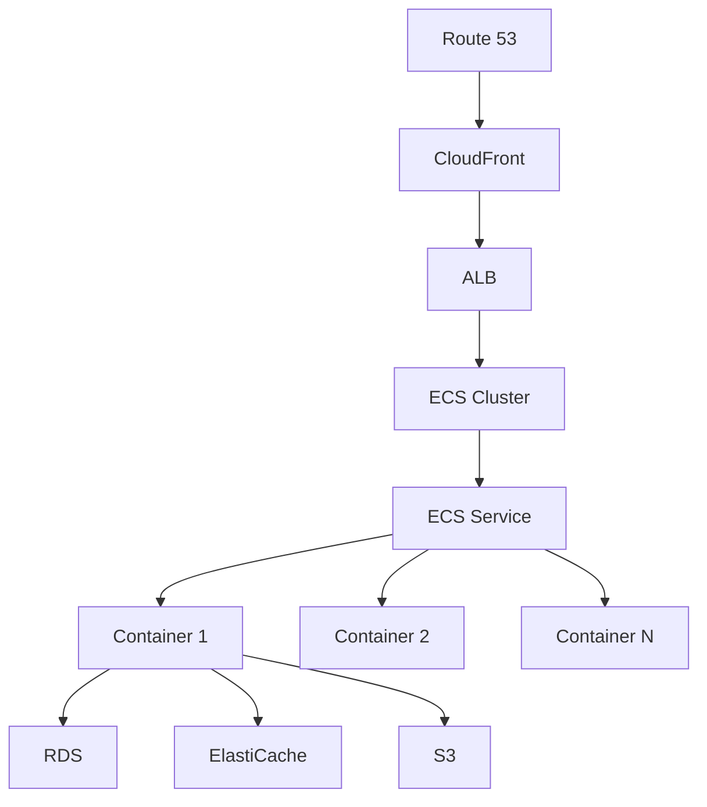

# Infrastructure Documentation

## Overview

This document details the infrastructure architecture, configuration, and management for the Visual Text Transformer application.

## Table of Contents

1. [Cloud Infrastructure](#1-cloud-infrastructure)
2. [Network Architecture](#2-network-architecture)
3. [Security Infrastructure](#3-security-infrastructure)
4. [Scaling Infrastructure](#4-scaling-infrastructure)
5. [Disaster Recovery](#5-disaster-recovery)
6. [Infrastructure as Code](#6-infrastructure-as-code)

## 1. Cloud Infrastructure

### 1.1 AWS Architecture



### 1.2 Resource Specifications

#### Compute Resources

```yaml
# ECS Task Definition
{
  'family': 'vtt-app',
  'containerDefinitions':
    [
      {
        'name': 'vtt-app',
        'image': 'vtt-app:latest',
        'cpu': 256,
        'memory': 512,
        'essential': true,
        'portMappings': [{ 'containerPort': 3000, 'hostPort': 3000, 'protocol': 'tcp' }],
        'environment': [{ 'name': 'NODE_ENV', 'value': 'production' }],
        'logConfiguration':
          {
            'logDriver': 'awslogs',
            'options':
              {
                'awslogs-group': '/ecs/vtt-app',
                'awslogs-region': 'us-west-2',
                'awslogs-stream-prefix': 'ecs',
              },
          },
      },
    ],
}
```

#### Database Resources

```yaml
# RDS Configuration
RDS:
  Engine: postgres
  Version: '14.5'
  InstanceClass: db.t3.medium
  AllocatedStorage: 100
  MultiAZ: true
  BackupRetentionPeriod: 7
  Parameters:
    max_connections: 200
    shared_buffers: 4GB
    effective_cache_size: 12GB
    maintenance_work_mem: 1GB
    checkpoint_completion_target: 0.9
    wal_buffers: 16MB
    default_statistics_target: 100
    random_page_cost: 1.1
    effective_io_concurrency: 200
```

#### Cache Resources

```yaml
# ElastiCache Configuration
ElastiCache:
  Engine: redis
  Version: '6.x'
  NodeType: cache.t3.medium
  NumCacheNodes: 2
  Parameters:
    maxmemory-policy: volatile-lru
    maxmemory: 2gb
    timeout: 300
    tcp-keepalive: 300
```

## 2. Network Architecture

### 2.1 VPC Configuration

```hcl
# VPC Configuration
resource "aws_vpc" "main" {
  cidr_block           = "10.0.0.0/16"
  enable_dns_hostnames = true
  enable_dns_support   = true

  tags = {
    Name = "vtt-${var.environment}-vpc"
  }
}

# Subnet Configuration
resource "aws_subnet" "public" {
  count             = 3
  vpc_id            = aws_vpc.main.id
  cidr_block        = "10.0.${count.index}.0/24"
  availability_zone = data.aws_availability_zones.available.names[count.index]

  tags = {
    Name = "vtt-${var.environment}-public-${count.index + 1}"
  }
}

resource "aws_subnet" "private" {
  count             = 3
  vpc_id            = aws_vpc.main.id
  cidr_block        = "10.0.${count.index + 10}.0/24"
  availability_zone = data.aws_availability_zones.available.names[count.index]

  tags = {
    Name = "vtt-${var.environment}-private-${count.index + 1}"
  }
}
```

### 2.2 Security Groups

```hcl
# Application Security Group
resource "aws_security_group" "app" {
  name        = "vtt-${var.environment}-app-sg"
  description = "Security group for application servers"
  vpc_id      = aws_vpc.main.id

  ingress {
    from_port       = 3000
    to_port         = 3000
    protocol        = "tcp"
    security_groups = [aws_security_group.alb.id]
  }

  egress {
    from_port   = 0
    to_port     = 0
    protocol    = "-1"
    cidr_blocks = ["0.0.0.0/0"]
  }
}

# Database Security Group
resource "aws_security_group" "db" {
  name        = "vtt-${var.environment}-db-sg"
  description = "Security group for database"
  vpc_id      = aws_vpc.main.id

  ingress {
    from_port       = 5432
    to_port         = 5432
    protocol        = "tcp"
    security_groups = [aws_security_group.app.id]
  }
}
```

## 3. Security Infrastructure

### 3.1 SSL/TLS Configuration

```yaml
# ACM Configuration
ACM:
  DomainName: '*.visualtexttransformer.com'
  ValidationMethod: DNS
  SubjectAlternativeNames:
    - 'visualtexttransformer.com'
    - 'api.visualtexttransformer.com'

# CloudFront SSL Configuration
CloudFront:
  ViewerCertificate:
    AcmCertificateArn: !Ref ACMCertificate
    SslSupportMethod: sni-only
    MinimumProtocolVersion: TLSv1.2_2021
```

### 3.2 WAF Configuration

```yaml
# WAF Rules
WAF:
  Rules:
    - Name: IPRateLimit
      Priority: 1
      Action: Block
      RateLimit: 2000
    - Name: SQLInjection
      Priority: 2
      Action: Block
    - Name: XSS
      Priority: 3
      Action: Block
    - Name: GeoBlock
      Priority: 4
      Action: Block
      Countries:
        - NK
        - IR
```

## 4. Scaling Infrastructure

### 4.1 Auto Scaling Configuration

```yaml
# ECS Auto Scaling
AutoScaling:
  Service:
    MinCapacity: 2
    MaxCapacity: 10
    TargetTrackingPolicies:
      - MetricName: CPUUtilization
        TargetValue: 70
      - MetricName: MemoryUtilization
        TargetValue: 80

# RDS Auto Scaling
RDSAutoScaling:
  Storage:
    MinCapacity: 100
    MaxCapacity: 1000
    TargetValue: 85
```

### 4.2 Load Balancer Configuration

```yaml
# ALB Configuration
ALB:
  Scheme: internet-facing
  SecurityGroups:
    - !Ref ALBSecurityGroup
  Subnets: !Ref PublicSubnets

  Listeners:
    - Port: 443
      Protocol: HTTPS
      Certificates:
        - !Ref ACMCertificate
      DefaultActions:
        - Type: forward
          TargetGroupArn: !Ref AppTargetGroup

  TargetGroups:
    - Name: app
      Port: 3000
      Protocol: HTTP
      HealthCheck:
        Path: /health
        Interval: 30
        Timeout: 5
        HealthyThreshold: 2
        UnhealthyThreshold: 3
```

## 5. Disaster Recovery

### 5.1 Backup Configuration

```yaml
# RDS Backup
RDSBackup:
  RetentionPeriod: 7
  BackupWindow: '03:00-04:00'
  SnapshotIdentifier: 'vtt-backup'
  CopyTags: true

# S3 Backup
S3Backup:
  Lifecycle:
    - ID: MoveToGlacier
      Prefix: backups/
      Status: Enabled
      Transition:
        Days: 90
        StorageClass: GLACIER
    - ID: Expiration
      Prefix: backups/
      Status: Enabled
      Expiration:
        Days: 365
```

### 5.2 Recovery Procedures

```bash
#!/bin/bash
# Database Recovery
restore_database() {
  local snapshot_id=$1
  local target_instance=$2

  aws rds restore-db-instance-from-db-snapshot \
    --db-instance-identifier $target_instance \
    --db-snapshot-identifier $snapshot_id

  # Wait for restoration
  aws rds wait db-instance-available \
    --db-instance-identifier $target_instance
}

# Application Recovery
deploy_application() {
  local version=$1
  local target_cluster=$2

  # Update ECS service
  aws ecs update-service \
    --cluster $target_cluster \
    --service vtt-service \
    --force-new-deployment \
    --task-definition vtt-app:$version
}
```

## 6. Infrastructure as Code

### 6.1 Terraform Modules

```hcl
# VPC Module
module "vpc" {
  source = "./modules/vpc"

  environment = var.environment
  cidr_block  = var.vpc_cidr

  azs             = var.availability_zones
  private_subnets = var.private_subnet_cidrs
  public_subnets  = var.public_subnet_cidrs

  enable_nat_gateway = true
  single_nat_gateway = var.environment != "production"

  tags = var.tags
}

# ECS Module
module "ecs" {
  source = "./modules/ecs"

  cluster_name = "vtt-${var.environment}"
  vpc_id       = module.vpc.vpc_id
  subnet_ids   = module.vpc.private_subnets

  app_image      = var.app_image
  app_port       = 3000
  cpu            = 256
  memory         = 512
  desired_count  = var.environment == "production" ? 3 : 1

  tags = var.tags
}
```

### 6.2 CloudFormation Templates

```yaml
# Main Stack
AWSTemplateFormatVersion: '2010-09-09'
Description: 'Visual Text Transformer Infrastructure'

Parameters:
  Environment:
    Type: String
    AllowedValues:
      - development
      - staging
      - production
    Default: development

Resources:
  VPCStack:
    Type: AWS::CloudFormation::Stack
    Properties:
      TemplateURL: !Sub 'https://${TemplateBucket}.s3.amazonaws.com/vpc.yaml'
      Parameters:
        Environment: !Ref Environment

  ECSStack:
    Type: AWS::CloudFormation::Stack
    Properties:
      TemplateURL: !Sub 'https://${TemplateBucket}.s3.amazonaws.com/ecs.yaml'
      Parameters:
        Environment: !Ref Environment
        VpcId: !GetAtt VPCStack.Outputs.VpcId
        SubnetIds: !GetAtt VPCStack.Outputs.PrivateSubnets

Outputs:
  ApiEndpoint:
    Description: 'API Gateway endpoint URL'
    Value: !GetAtt APIStack.Outputs.ApiEndpoint
```

## 7. Monitoring and Metrics

### 7.1 CloudWatch Configuration

```yaml
# CloudWatch Alarms
Alarms:
  HighCPU:
    Metric: CPUUtilization
    Threshold: 80
    Period: 300
    EvaluationPeriods: 2
    Action: SNS

  HighMemory:
    Metric: MemoryUtilization
    Threshold: 80
    Period: 300
    EvaluationPeriods: 2
    Action: SNS

  DatabaseConnections:
    Metric: DatabaseConnections
    Threshold: 180
    Period: 300
    EvaluationPeriods: 2
    Action: SNS

# CloudWatch Dashboards
Dashboards:
  Application:
    Widgets:
      - Type: metric
        Properties:
          Metrics:
            - CPU
            - Memory
            - RequestCount
            - ErrorRate
      - Type: log
        Properties:
          LogGroup: /aws/ecs/vtt-app
          QueryString: 'fields @timestamp, @message | filter @message like /ERROR/'
```

### 7.2 Logging Configuration

```yaml
# CloudWatch Logs
LogGroups:
  Application:
    RetentionInDays: 30
    FilterPatterns:
      - ErrorPattern: 'ERROR'
      - WarningPattern: 'WARN'
      - DebugPattern: 'DEBUG'

  AccessLogs:
    RetentionInDays: 90
    FilterPatterns:
      - StatusCode4xx: '[timestamp, status=4*, size, client, request]'
      - StatusCode5xx: '[timestamp, status=5*, size, client, request]'
```

## 8. Cost Management

### 8.1 Resource Tagging

```yaml
# Tagging Strategy
Tags:
  Mandatory:
    - Key: Environment
      Values:
        - development
        - staging
        - production
    - Key: Project
      Value: vtt
    - Key: CostCenter
      Value: engineering

  Optional:
    - Key: Owner
      Value: team-name
    - Key: Temporary
      Value: true/false
```

### 8.2 Cost Allocation

```yaml
# Cost Allocation Tags
CostAllocation:
  Tags:
    - Environment
    - CostCenter
    - Project

  Budgets:
    Development:
      Monthly: 1000
      Alert:
        Threshold: 80
        SNSTopic: cost-alerts

    Production:
      Monthly: 5000
      Alert:
        Threshold: 90
        SNSTopic: cost-alerts
```

## 9. Compliance and Auditing

### 9.1 AWS Config Rules

```yaml
# Config Rules
ConfigRules:
  - Name: encrypted-volumes
    Source: AWS::EC2::Volume
    Rule: ENCRYPTED_VOLUMES

  - Name: rds-encryption
    Source: AWS::RDS::DBInstance
    Rule: RDS_STORAGE_ENCRYPTED

  - Name: s3-encryption
    Source: AWS::S3::Bucket
    Rule: S3_BUCKET_SERVER_SIDE_ENCRYPTION_ENABLED
```

### 9.2 CloudTrail Configuration

```yaml
# CloudTrail
CloudTrail:
  IsMultiRegionTrail: true
  IncludeGlobalServices: true
  EnableLogFileValidation: true

  EventSelectors:
    - ReadWriteType: WriteOnly
      IncludeManagementEvents: true
      DataResources:
        - Type: AWS::S3::Object
          Values:
            - arn:aws:s3:::vtt-*/*
```
