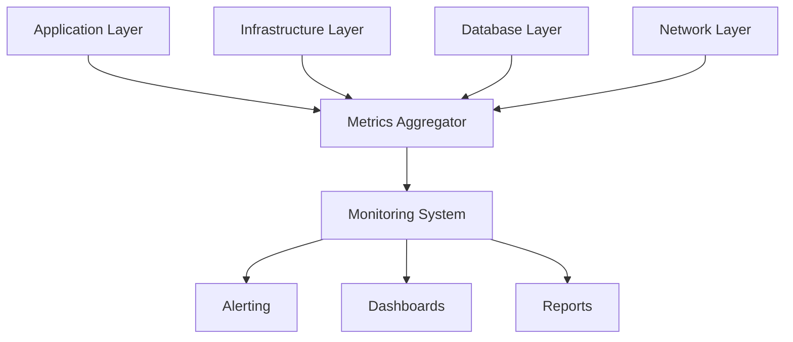

# Monitoring & Alerting Documentation

## Overview

This document outlines the monitoring strategy, alert configurations, and incident response procedures for the Visual Text Transformer application.

## Table of Contents

1. [Monitoring Strategy](#1-monitoring-strategy)
2. [Metrics Collection](#2-metrics-collection)
3. [Alert Configuration](#3-alert-configuration)
4. [Logging Strategy](#4-logging-strategy)
5. [Dashboards](#5-dashboards)
6. [Incident Response](#6-incident-response)

## 1. Monitoring Strategy

### 1.1 Monitoring Layers



### 1.2 Monitoring Tools

- Application Performance: New Relic
- Infrastructure: CloudWatch
- Logs: ELK Stack
- Uptime: Pingdom
- Error Tracking: Sentry
- Real User Monitoring: New Relic Browser

## 2. Metrics Collection

### 2.1 Application Metrics

```typescript
// Metrics Configuration
const metrics = {
  // Response Time Metrics
  responseTime: new Histogram({
    name: 'http_request_duration_seconds',
    help: 'HTTP request duration in seconds',
    labelNames: ['method', 'route', 'status_code'],
    buckets: [0.1, 0.3, 0.5, 0.7, 1, 3, 5, 7, 10],
  }),

  // Request Count Metrics
  requestCount: new Counter({
    name: 'http_requests_total',
    help: 'Total number of HTTP requests',
    labelNames: ['method', 'route', 'status_code'],
  }),

  // Error Metrics
  errorCount: new Counter({
    name: 'application_errors_total',
    help: 'Total number of application errors',
    labelNames: ['error_type', 'error_code'],
  }),

  // Business Metrics
  visualizationCreated: new Counter({
    name: 'visualizations_created_total',
    help: 'Total number of visualizations created',
    labelNames: ['type', 'user_tier'],
  }),
};

// Middleware for collecting metrics
app.use((req, res, next) => {
  const start = process.hrtime();

  res.on('finish', () => {
    const duration = process.hrtime(start);
    const durationSeconds = duration[0] + duration[1] / 1e9;

    metrics.responseTime.observe(
      {
        method: req.method,
        route: req.route?.path || 'unknown',
        status_code: res.statusCode,
      },
      durationSeconds
    );

    metrics.requestCount.inc({
      method: req.method,
      route: req.route?.path || 'unknown',
      status_code: res.statusCode,
    });
  });

  next();
});
```

### 2.2 Infrastructure Metrics

```yaml
# CloudWatch Metrics Configuration
MetricFilters:
  # CPU Utilization
  - name: CPUUtilization
    namespace: AWS/ECS
    dimensions:
      - name: ClusterName
        value: vtt-cluster
      - name: ServiceName
        value: vtt-service
    statistic: Average
    period: 60
    evaluationPeriods: 2
    threshold: 80
    comparisonOperator: GreaterThanThreshold

  # Memory Utilization
  - name: MemoryUtilization
    namespace: AWS/ECS
    dimensions:
      - name: ClusterName
        value: vtt-cluster
      - name: ServiceName
        value: vtt-service
    statistic: Average
    period: 60
    evaluationPeriods: 2
    threshold: 80
    comparisonOperator: GreaterThanThreshold

  # Database Connections
  - name: DatabaseConnections
    namespace: AWS/RDS
    dimensions:
      - name: DBInstanceIdentifier
        value: vtt-db
    statistic: Average
    period: 60
    evaluationPeriods: 2
    threshold: 80
    comparisonOperator: GreaterThanThreshold
```

## 3. Alert Configuration

### 3.1 Alert Thresholds

```yaml
# Alert Definitions
Alerts:
  High:
    Priority: P1
    ResponseTime: 15m
    Notification:
      - PagerDuty
      - Slack
    Conditions:
      - Metric: http_error_rate
        Threshold: >5
        Duration: 5m
      - Metric: service_availability
        Threshold: <99.9%
        Duration: 5m
      - Metric: database_connections
        Threshold: >90
        Duration: 5m

  Medium:
    Priority: P2
    ResponseTime: 30m
    Notification:
      - Slack
    Conditions:
      - Metric: http_latency_p95
        Threshold: >2
        Duration: 10m
      - Metric: cpu_utilization
        Threshold: >80
        Duration: 15m
      - Metric: memory_utilization
        Threshold: >80
        Duration: 15m

  Low:
    Priority: P3
    ResponseTime: 4h
    Notification:
      - Email
    Conditions:
      - Metric: disk_usage
        Threshold: >70
        Duration: 30m
      - Metric: cache_hit_rate
        Threshold: <80%
        Duration: 30m
```

### 3.2 Alert Routing

```yaml
# PagerDuty Integration
PagerDuty:
  ServiceIntegration:
    Name: VTT-Production
    IntegrationType: events_api_v2
    Escalation:
      Level1:
        Team: Platform
        Timeout: 15m
      Level2:
        Team: Engineering
        Timeout: 30m
      Level3:
        Team: Management
        Timeout: 1h

# Slack Integration
Slack:
  Channels:
    - Name: #vtt-alerts
      Priority: High
      Notifications: true
    - Name: #vtt-monitoring
      Priority: Medium
      Notifications: false

# Email Integration
Email:
  Recipients:
    High:
      - platform-team@company.com
      - engineering-leads@company.com
    Medium:
      - engineering-team@company.com
    Low:
      - engineering-notifications@company.com
```

## 4. Logging Strategy

### 4.1 Log Levels

```typescript
// Logger Configuration
const logger = winston.createLogger({
  levels: {
    error: 0, // System errors, data loss
    warn: 1, // Degraded service, performance issues
    info: 2, // Normal operations
    debug: 3, // Detailed debugging information
    trace: 4, // Very detailed debugging information
  },

  format: winston.format.combine(winston.format.timestamp(), winston.format.json()),

  defaultMeta: {
    service: 'vtt-app',
    environment: process.env.NODE_ENV,
  },

  transports: [
    new winston.transports.Console({
      level: process.env.LOG_LEVEL || 'info',
    }),
    new winston.transports.File({
      filename: 'error.log',
      level: 'error',
    }),
    new winston.transports.File({
      filename: 'combined.log',
    }),
  ],
});
```

### 4.2 Log Aggregation

```yaml
# Logstash Configuration
input {
beats {
port => 5044
}
}

filter {
json {
source => "message"
}

date {
match => ["timestamp", "ISO8601"]
target => "@timestamp"
}

grok {
match => {
"message" => "%{TIMESTAMP_ISO8601:timestamp} %{LOGLEVEL:level} %{GREEDYDATA:message}"
}
}
}

output {
elasticsearch {
hosts => ["elasticsearch:9200"]
index => "vtt-logs-%{+YYYY.MM.dd}"
}
}
```

## 5. Dashboards

### 5.1 Operations Dashboard

```yaml
# Grafana Dashboard Configuration
Dashboard:
  Title: VTT Operations
  Refresh: 1m

  Panels:
    # System Health
    - Title: System Health
      Type: stat
      Metrics:
        - service_availability
        - error_rate
        - response_time_p95

    # Request Statistics
    - Title: Request Statistics
      Type: graph
      Metrics:
        - requests_per_second
        - average_response_time
        - error_count

    # Resource Usage
    - Title: Resource Usage
      Type: gauge
      Metrics:
        - cpu_utilization
        - memory_utilization
        - disk_usage

    # Database Metrics
    - Title: Database Performance
      Type: graph
      Metrics:
        - db_connections
        - db_latency
        - query_throughput
```

### 5.2 Business Dashboard

```yaml
# Business Metrics Dashboard
Dashboard:
  Title: VTT Business Metrics
  Refresh: 5m

  Panels:
    # User Activity
    - Title: User Activity
      Type: graph
      Metrics:
        - active_users
        - new_registrations
        - user_retention

    # Visualization Usage
    - Title: Visualization Usage
      Type: graph
      Metrics:
        - visualizations_created
        - exports_completed
        - processing_time

    # Error Analysis
    - Title: Error Analysis
      Type: table
      Metrics:
        - error_type
        - error_count
        - affected_users
```

## 6. Incident Response

### 6.1 Incident Levels

```yaml
# Incident Classification
IncidentLevels:
  SEV1:
    Description: 'Critical service outage'
    Response: 'Immediate response required'
    Examples:
      - Complete service unavailability
      - Data loss or corruption
      - Security breach
    Notification:
      - PagerDuty
      - SMS
      - Phone Call
    SLA: 15m

  SEV2:
    Description: 'Partial service degradation'
    Response: 'Urgent response required'
    Examples:
      - Significant performance degradation
      - Feature unavailability
      - Integration failures
    Notification:
      - PagerDuty
      - Slack
    SLA: 30m

  SEV3:
    Description: 'Minor service issue'
    Response: 'Normal response'
    Examples:
      - Non-critical bug
      - Minor performance issue
      - UI/UX issues
    Notification:
      - Slack
      - Email
    SLA: 4h
```

### 6.2 Incident Response Procedures

```yaml
# Incident Response Workflow
ResponseProcedures:
  Detection:
    - Monitor alerts and dashboards
    - Receive user reports
    - Automated monitoring triggers

  Triage:
    - Assess incident severity
    - Identify affected components
    - Determine impact scope
    - Assign response team

  Investigation:
    - Gather relevant logs
    - Analyze metrics
    - Review recent changes
    - Identify root cause

  Resolution:
    - Implement fix
    - Verify solution
    - Monitor for recurrence
    - Update documentation

  Communication:
    - Internal updates
    - User notifications
    - Status page updates
    - Post-mortem report
```

### 6.3 Post-Mortem Template

```markdown
# Incident Post-Mortem

## Overview

- Date: [Incident Date]
- Duration: [Duration]
- Impact: [Description of Impact]
- Severity: [SEV Level]

## Timeline

- [Time] - Initial detection
- [Time] - Investigation started
- [Time] - Root cause identified
- [Time] - Resolution implemented
- [Time] - Service restored

## Root Cause

[Detailed description of what caused the incident]

## Resolution

[Description of how the incident was resolved]

## Impact

- Users Affected: [Number]
- Services Affected: [List]
- Data Impact: [Description]

## Lessons Learned

- What went well
- What went wrong
- What could be improved

## Action Items

- [ ] Short-term fixes
- [ ] Long-term improvements
- [ ] Process updates
- [ ] Documentation updates

## Prevention

[Steps to prevent similar incidents]
```

## 7. Maintenance Procedures

### 7.1 Regular Maintenance

```yaml
# Maintenance Schedule
MaintenanceSchedule:
  Daily:
    - Log rotation
    - Metric aggregation
    - Alert verification

  Weekly:
    - Dashboard review
    - Alert threshold review
    - Performance analysis

  Monthly:
    - Capacity planning
    - Trend analysis
    - SLA review

  Quarterly:
    - System audit
    - Documentation update
    - Tool evaluation
```

### 7.2 Maintenance Windows

```yaml
# Maintenance Windows
MaintenanceWindows:
  Production:
    Primary:
      Day: Sunday
      Time: 02:00-04:00 UTC
    Secondary:
      Day: Wednesday
      Time: 02:00-03:00 UTC

  Staging:
    Primary:
      Day: Saturday
      Time: 02:00-06:00 UTC
    Secondary:
      Day: Tuesday
      Time: 02:00-04:00 UTC
```
