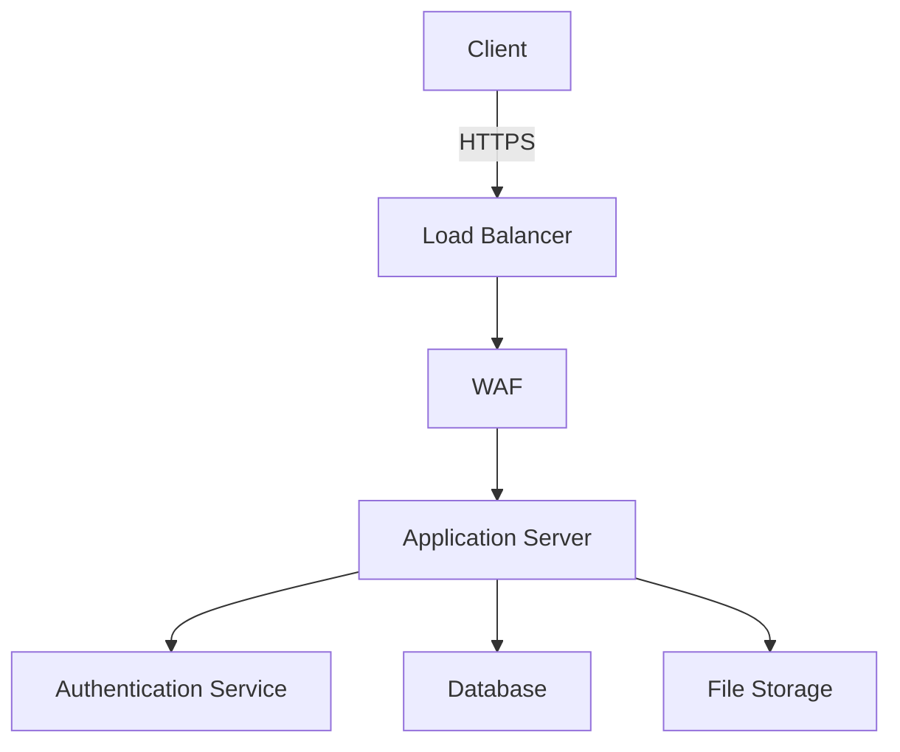

# Security Documentation

## Overview

This document outlines the security measures, policies, and implementation guidelines for the Visual Text Transformer application.

## 1. Security Architecture

### 1.1 Security Layers

1. Application Layer

   - Input validation
   - Output encoding
   - Authentication
   - Authorization

2. Network Layer

   - TLS/SSL encryption
   - Firewall rules
   - DDoS protection
   - Rate limiting

3. Data Layer
   - Encryption at rest
   - Encryption in transit
   - Access controls
   - Data masking

### 1.2 Security Components



## 2. Authentication and Authorization

### 2.1 Authentication Implementation

```typescript
// JWT Token Structure
interface JWTToken {
  header: {
    alg: 'RS256';
    typ: 'JWT';
  };
  payload: {
    sub: string; // User ID
    email: string; // User email
    role: string; // User role
    iat: number; // Issued at
    exp: number; // Expiration
    jti: string; // JWT ID
  };
  signature: string;
}

// Authentication Middleware
const authenticate = async (req: Request, res: Response, next: NextFunction) => {
  try {
    const token = req.headers.authorization?.split(' ')[1];
    if (!token) throw new UnauthorizedError();

    const decoded = await verifyToken(token);
    req.user = decoded;
    next();
  } catch (error) {
    next(new UnauthorizedError());
  }
};
```

### 2.2 Authorization Policies

```typescript
// Role-Based Access Control
const roles = {
  ADMIN: 'admin',
  USER: 'user',
  GUEST: 'guest',
};

const permissions = {
  CREATE_VISUALIZATION: 'create:visualization',
  DELETE_VISUALIZATION: 'delete:visualization',
  EXPORT_VISUALIZATION: 'export:visualization',
};

const rolePermissions = {
  [roles.ADMIN]: Object.values(permissions),
  [roles.USER]: [permissions.CREATE_VISUALIZATION, permissions.EXPORT_VISUALIZATION],
  [roles.GUEST]: [],
};

// Authorization Middleware
const authorize = (requiredPermission: string) => {
  return (req: Request, res: Response, next: NextFunction) => {
    const userPermissions = rolePermissions[req.user.role];
    if (!userPermissions.includes(requiredPermission)) {
      throw new ForbiddenError();
    }
    next();
  };
};
```

## 3. Data Security

### 3.1 Encryption

```typescript
// Data Encryption Service
class EncryptionService {
  private readonly algorithm = 'aes-256-gcm';
  private readonly key: Buffer;

  constructor(secretKey: string) {
    this.key = crypto.scryptSync(secretKey, 'salt', 32);
  }

  encrypt(data: string): EncryptedData {
    const iv = crypto.randomBytes(12);
    const cipher = crypto.createCipheriv(this.algorithm, this.key, iv);

    let encrypted = cipher.update(data, 'utf8', 'hex');
    encrypted += cipher.final('hex');

    return {
      encrypted,
      iv: iv.toString('hex'),
      tag: cipher.getAuthTag().toString('hex'),
    };
  }

  decrypt(data: EncryptedData): string {
    const decipher = crypto.createDecipheriv(this.algorithm, this.key, Buffer.from(data.iv, 'hex'));

    decipher.setAuthTag(Buffer.from(data.tag, 'hex'));

    let decrypted = decipher.update(data.encrypted, 'hex', 'utf8');
    decrypted += decipher.final('utf8');

    return decrypted;
  }
}
```

### 3.2 Data Masking

```typescript
// Data Masking Rules
const maskingRules = {
  email: (email: string) => {
    const [local, domain] = email.split('@');
    return `${local[0]}***@${domain}`;
  },
  phone: (phone: string) => {
    return phone.replace(/(\d{3})\d{4}(\d{4})/, '$1****$2');
  },
  creditCard: (card: string) => {
    return `****-****-****-${card.slice(-4)}`;
  },
};
```

## 4. Input Validation and Sanitization

### 4.1 Input Validation

```typescript
// Validation Schema
const visualizationSchema = Joi.object({
  text: Joi.string()
    .required()
    .min(1)
    .max(10000)
    .pattern(/^[\w\s.,!?-]+$/),

  type: Joi.string().required().valid('wordcloud', 'chart', 'mindmap'),

  options: Joi.object({
    width: Joi.number().min(100).max(4000),
    height: Joi.number().min(100).max(4000),
    style: Joi.string().valid('modern', 'classic', 'minimal'),
  }),
});

// Validation Middleware
const validateInput = (schema: Joi.Schema) => {
  return (req: Request, res: Response, next: NextFunction) => {
    const { error } = schema.validate(req.body);
    if (error) throw new ValidationError(error.details[0].message);
    next();
  };
};
```

### 4.2 Output Sanitization

```typescript
// HTML Sanitization
const sanitizeHtml = (html: string): string => {
  return DOMPurify.sanitize(html, {
    ALLOWED_TAGS: ['p', 'b', 'i', 'em', 'strong'],
    ALLOWED_ATTR: ['class'],
  });
};

// JSON Sanitization
const sanitizeJson = (obj: any): any => {
  return JSON.parse(
    JSON.stringify(obj, (key, value) => {
      if (typeof value === 'string') {
        return sanitizeHtml(value);
      }
      return value;
    })
  );
};
```

## 5. API Security

### 5.1 Rate Limiting

```typescript
// Rate Limiter Configuration
const rateLimiter = rateLimit({
  windowMs: 15 * 60 * 1000, // 15 minutes
  max: 100, // limit each IP to 100 requests per windowMs
  message: 'Too many requests, please try again later',
  headers: true,
  handler: (req, res) => {
    throw new TooManyRequestsError();
  },
});

// API-specific Rate Limits
const apiLimits = {
  '/api/visualizations': {
    windowMs: 60 * 60 * 1000, // 1 hour
    max: 50,
  },
  '/api/exports': {
    windowMs: 60 * 60 * 1000, // 1 hour
    max: 20,
  },
};
```

### 5.2 API Key Management

```typescript
// API Key Service
class ApiKeyService {
  async generateKey(userId: string): Promise<string> {
    const key = crypto.randomBytes(32).toString('hex');
    const hash = await bcrypt.hash(key, 10);

    await db.apiKeys.create({
      userId,
      keyHash: hash,
      expiresAt: new Date(Date.now() + 30 * 24 * 60 * 60 * 1000),
    });

    return key;
  }

  async validateKey(key: string): Promise<boolean> {
    const apiKey = await db.apiKeys.findOne({
      where: { keyHash: await bcrypt.hash(key, 10) },
    });

    return !!apiKey && new Date() < apiKey.expiresAt;
  }
}
```

## 6. Security Monitoring and Logging

### 6.1 Logging Configuration

```typescript
// Winston Logger Configuration
const logger = winston.createLogger({
  level: 'info',
  format: winston.format.combine(winston.format.timestamp(), winston.format.json()),
  transports: [
    new winston.transports.File({ filename: 'error.log', level: 'error' }),
    new winston.transports.File({ filename: 'combined.log' }),
  ],
});

// Security Event Logging
const logSecurityEvent = (eventType: string, userId: string, details: any) => {
  logger.info('Security Event', {
    eventType,
    userId,
    details,
    timestamp: new Date().toISOString(),
  });
};
```

### 6.2 Monitoring Alerts

```typescript
// Alert Configuration
const alertThresholds = {
  failedLogins: {
    count: 5,
    timeWindow: 15 * 60 * 1000, // 15 minutes
    action: 'lockAccount',
  },
  apiErrors: {
    count: 100,
    timeWindow: 5 * 60 * 1000, // 5 minutes
    action: 'notifyAdmin',
  },
};

// Alert Handler
const handleSecurityAlert = async (alertType: string, details: any) => {
  await notificationService.sendAlert({
    type: alertType,
    details,
    timestamp: new Date().toISOString(),
  });
};
```

## 7. Security Policies

### 7.1 Password Policy

- Minimum length: 12 characters
- Must contain:
  - Uppercase letters
  - Lowercase letters
  - Numbers
  - Special characters
- Maximum age: 90 days
- No reuse of last 5 passwords

### 7.2 Session Policy

- Session timeout: 30 minutes
- Maximum concurrent sessions: 3
- Session invalidation on password change
- Secure session cookie settings

### 7.3 API Security Policy

- HTTPS only
- API key rotation every 30 days
- Rate limiting per endpoint
- Request size limits

### 7.4 Data Retention Policy

- User data: 7 years
- Logs: 1 year
- Temporary files: 24 hours
- Backup retention: 30 days

## 8. Incident Response

### 8.1 Response Plan

1. Detection
2. Analysis
3. Containment
4. Eradication
5. Recovery
6. Post-incident review

### 8.2 Contact Information

- Security Team: security@example.com
- Emergency Contact: +1-xxx-xxx-xxxx
- Data Protection Officer: dpo@example.com

## 9. Compliance

### 9.1 GDPR Compliance

- Data minimization
- Purpose limitation
- Storage limitation
- Data subject rights
- Privacy by design

### 9.2 Security Standards

- OWASP Top 10
- NIST Cybersecurity Framework
- ISO 27001
- SOC 2 Type II

## 10. Security Testing

### 10.1 Penetration Testing

- Quarterly external penetration tests
- Annual internal security assessment
- Continuous vulnerability scanning

### 10.2 Security Review Process

- Code review guidelines
- Security testing checklist
- Deployment security verification
- Third-party dependency audit
